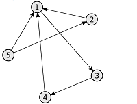
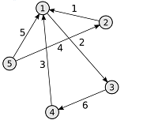
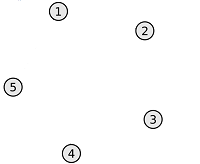
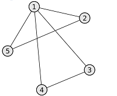
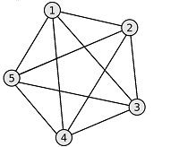
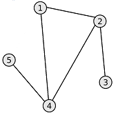
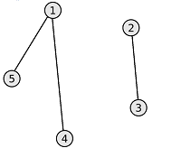
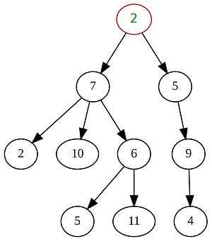
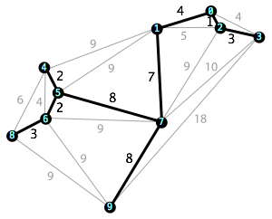

# GraphAlgorithms
This repository implements various algorithms for graphs
**Граф** - это совокупность конечного множества вершин и множества ребер. Каждому ребру сопоставлены две точки из множества вершин графа, образующие граничные точки ребра.

**Виды графов по типу рёбер:**
* *неориентированный* - граф, в котором перемещение между вершинами, соединёнными ребром, возможно в любом направлении

* *ориентированный* - граф, рёбрам которого присвоено направление. Направленные рёбра именуются также дугами. Перемещение из одной вершины в другую возможно только по дугам соответствующего направления

Если помимо наличия ребра между двумя вершинами, задан ещё и вес ребра, то такой граф называется ***взвешенным***

**Виды графов по числу рёбер:**
* *нулевой* - в графе отсутствуют рёбра

* *неполный* - в графе есть рёбра, но не из каждой вершины, есть ребро в любую другую вершину

* *полный* - в графе из каждой вершины есть ребро в любую другую вершину

**Виды графов по достижимости узлов:**
* *связный* - для любой вершины в графе есть хотя бы один путь до любой другой верины в этом же графе

* *несвязный* - в графе отсутствует путь хотя бы между двумя его вершинами

Для ориентированных графов дополнительно разделяют ещё два типа связности: *сильносвязный* и *слабосвязный*.
* *сильносвязный* - для любой вершины в ориентированном графе существует путь в любую другую вершину и обратно.
* *слабосвязный* - между двумя любыми вершинами в графе существует путь, но этот путь может быть односторонним. Т.е. из вершины А в вершину B путь может существовать, а обратно нет.

**Деревья**

Отдельным важным подтипом графов являются *деревья*. \
***Дерево*** - это связный ациклический граф, в котором любые две вершины соединены лишь одним маршрутом. Для любого дерева справедлива следующая формула: *q = n - 1*, где q - это число рёбер, n - число вершин графа (дерева). Деревья могут быть построены на базе как неориентированных графов, так и ориентированных, в зависимости от решаемой задачи.

***Остовное дерево (остов)*** — это подграф данного графа, содержащий все его вершины и являющийся деревом. Рёбра графа, не входящие в остов, называются хордами графа относительно остова.

### Способы задания графа

Существуют следующие основные способы задания графов:
* *матрица смежности* - квадратная матрица, размерность которой равна числу вершин в графе, и в которой $`A_{ij}`$ элемент матрицы содержит в себе информацию о ребре из вершины $`i`$ в вершину $`j`$. Возможные значения, которые может принимать $`A_{ij}`$:
    + для невзвешенного неориентированного графа:
        - 0 - ребра между вершинами нет
        - 1 - ребро между вершинами есть
    + для взвешенного неориентированного графа:
        - 0 - ребра между вершинами нет
        - N - ребро между вершинами есть, и его вес равен N
    + для невзвешенного ориентированного графа:
        - 0 - дуги между вершинами нет
        - 1 - есть дуга (ориентированное ребро), которая направлена из вершины $`i`$ в вершину $`j`$
    + для взвешенного ориентированного графа:
        - 0 - дуги между вершинами нет
        - N - есть дуга (ориентированное ребро), которая направлена из вершины $`i`$ в вершину $`j`$, и её вес равен N
* *матрица инцидентности* - это матрица, количество строк в которой соответствует числу вершин, а количество столбцов – числу рёбер. В ней указываются связи между инцидентными элементами графа (ребро (дуга) и вершина). В неориентированном графе если вершина инцидентна ребру, то соответствующий элемент равен 1, в противном случае элемент равен 0. В ориентированном графе если ребро выходит из вершины, то соответствующий элемент равен 1, если ребро входит в вершину, то соответствующий элемент равен -1, если ребро отсутствует, то элемент равен 0.

Пример задания графа с помощью матрицы смежности можно найти в материалах.

Если количество ребер графа по сравнению с количеством вершин невелико, то значения большинства элементов матрицы смежности будут равны 0. При этом использование данного метода нецелесообразно. Для подобных графов имеются более оптимальные способы их представления:

* *список смежности* - один из способов представления графа в виде коллекции списков вершин. Каждой вершине графа соответствует список, состоящий из «соседей» (т.е. из вершин, которые непосредственно достижимы напрямую из текущей вершины) этой вершины с указанием весов рёбер.
* *список рёбер* - таблица (матрица размерность Nx3), в каждой строке которой записаны две смежные вершины и вес, соединяющего их ребра.
